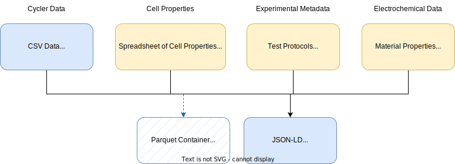
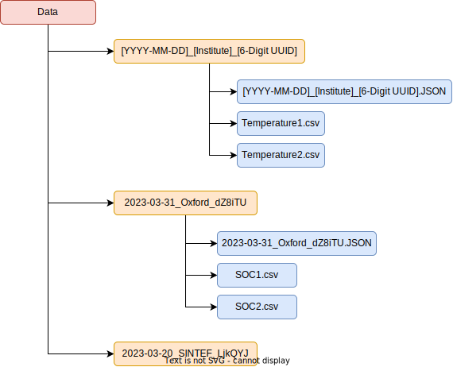

# IntelLiGent-Data-Standard

This repository introduces the IntelLiGent data-sharing standard and is aimed to improve contextual data sharing for partners. The structure of the repository is as follows,

- An overview of a conventional data pipeline for experimental battery testing.
- An overview of the JSON-LD format with an accompanying template.
- An example workflow for the creation of the JSON-LD metadata file.
- The directory naming convention as well as the UUID convention.

# Framework Overview

A conventional data pipeline for experimental electrochemical testing is presented below. The top row of containers represents the standard data structures that are generated, or stored during the process. This is presented as one potential representation; however, the divisions between these discrete containers aren't fixed. For example, the electrochemical data container and cell properties container could be stored as one in certain workflows. 

In the above figure, the blue containers denote the finalised structure for sharing data between partners. The hatched "Parquet" container offers a potential improvement over the "CSV" container in regards to storage size and access speed; however, reduced human readability. 

# Data Storage

The directory structure for storing the metadata (JSON) and data (CSV) defined in the above figure is presented below. This structure utilised UUID's to differentiate items while enabling future knowledge tree integration. By incorporating a UUID into the individual test directory, the encompassing data files don't need to have unique identifiers; however, we recommend these are labelled for human understanding. An example is shown in the figure below for both temperature and state-of-charge specific containers. The definition of these experiments would be included in the corresponding JSON file.

